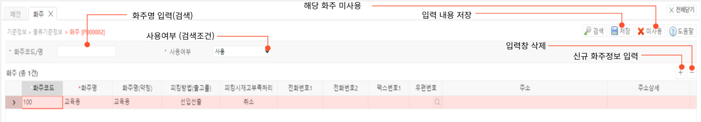

# 화주

**화주 기능은 WMS 계정 내 별도 화주 그룹의 생성과 관리에 사용됩니다.** 

---

## **1. 화주 계정 생성**

우측 하단의 + 모양의 버튼을 통해 신규 화주를 등록할 수 있습니다.

신규 화주 등록시 입력 내역은 다음과 같습니다.

- **화주코드 (필수)**  
화주의 고유 코드입니다.  
별도의 생성 룰은 없으며 한글입력이 가능합니다.  
생성 완료시 수정이 불가하므로 정확히 입력해주시기 바랍니다.

- **화주명 (필수)  
** 화주의 명칭입니다. 코드와 달리 수정 가능합니다.
- **피킹방법(출고룰)**  
 선입선출 / 제조일자 기준 / 가까운 로케이션 / 재고많은 로케이션 /  
 선입선출 보충+ 피킹 / 제조일자 기준 보충 + 피킹 / 제조알지 기준 보충 + 피킹 /  
 가까운 로케이션 보충 + 피킹 / 재고많은 로케이션 보충 + 피킹  
 중 선택 가능합니다.  
 
    - 각 옵션의 처리 룰은 다음과 같습니다.
      - 선입선출  
      먼저 입고된 상품을 우선 출고합니다.
      - 제조일자 기준  
      제조일자가 가장 오래된 상품을 우선 출고합니다.
      - 가까운 로케이션  
      피킹존에서 가장 가까운곳에 위치한 상품을 우선 출고합니다.
      - 재고 많은 로케이션  
      가장 재고가 많은 로케이션에 위치한 상품을 우선 출고합니다.
        
    보충+피킹의 기준도 위와 동일하나, 상품의 피킹 전 보충작업까지도 위의 기준을 적용하여 기준에 맞는 상품을 우선 사용합니다.
        
- **피킹시재고부족처리**  
피킹시 재고부족분에 대한 처리 방식으로, **취소 / 재고내역만 처리** 중 한가지를 선택할 수 있습니다.
  - 취소 : 피킹시 재고부족 주문건 전체 작업 취소
  - 재고내역만 처리 : 피킹시 재고부족 상품 제외하고 피킹
- **전화번호**  
화주의 연락처를 입력합니다.
- **우편번호 / 주소**  
우편번호 입력칸 우측 돋보기 버튼을 눌러 화주의 우편번호와 주소를 검색합니다.  
주소의 검색 결과를 클릭시 우편번호와 주소가 자동 입력됩니다.
- **주소상세**  
주소 내 상세 위치를 입력합니다.
- **사업자 번호**  
화주의 사업자 번호를 입력합니다.
- **대표 이메일**  
화주의 이메일 주소를 입력합니다.
- **비고**  
기타 참고 사항을 입력합니다.

---

## **2. 버튼별 기능**

- **공통버튼**
    - **검색**  선택된 검색 조건으로 검색하여 화주정보를 조회합니다.
    - **저장**  신규 화주 정보를 입력 후 저장하거나, 저장된 화주의 정보를 수정합니다.
    - **미사용**  선택된 화주를 미사용처리 합니다. 미사용 처리된 화주는 프로세스 진행이 제한됩니다

- **심화 기능**
    - 피킹시 재고 부족처리, 가입고 자동생성 여부와 피킹방법(출고룰) 선택으로 피킹 또는 보충 시 룰을 정할 수 있습니다

---