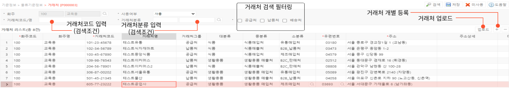

# 거래처

**거래처 기능은 거래의 정보 입력 및 관리에 사용됩니다.**

---

## **1. 신규 거래처 분류 기준 생성**

- 신규 로케이션 등록은 두가지 기능을 이용할 수 있습니다.
  - 우측 상단 + 버튼을 눌러 개별 입력
  - 우측 상단 업로드 버튼을 통한 로케이션 내역 일괄 엑셀 업로드  

(업로드 버튼 누른 후 업로드 내역 입력창에서 우측버튼 누르고 ‘Excel 다운로드’ 후 1열 (체크메세지) 제외한 값 입력 후 재업로드.  체크 후 에러 발생시 수정하여 업로드)  

신규 거래처 분류 기준 생성을 위해서는 다음 항목을 입력해야 합니다.

- **화주코드(필수) / 화주명**  
거래처의 담당 화주 코드와 화주명을 입력합니다.  
단일 화주의 경우 자동으로 입력됩니다.

- **거래처코드(필수)**  
거래처의 고유 코드입니다.  
생성 후 수정이 불가합니다.
- **거래처명(필수)**  
거래처의 명칭입니다.
- **거래처그룹 / 대분류 / 중분류 / 소분류**  
거래처 그룹은 납품처 / 공급처 / 온라인 / 메세지 중 하나를 선택할 수 있으며, 
대/중/소분류는 **[기준정보>물류 기준정보>거래처 분류]**에서 생성한 분류 중 하나로 지정할 수 있습니다.
- **우편번호(필수) / 주소(필수) / 주소상세**  
우편번호 입력칸 우측의 돋보기 버튼을 눌러 창고의 우편번호와 주소를 검색합니다.  
주소의 검색 결과를 클릭시 우편번호와 주소가 자동 입력됩니다.
- **대표자 / 사업자번호 / 업태 / 업종**  
거래처의 기업 정보를 입력합니다.
- **공급처 / 납품처 / 배송처**  
거래처와의 거래 유형에 맞게 체크 합니다.
- **연락처1 / 연락처2 / FAX1**  
거래처의 연락처를 기입합니다.
- **담당자명 / 담당자연락처 / 이메일**  
거래처 담당자의 연락처를 기입합니다.
- **비고**  
기타 특이사항 및 공유사항을 기입합니다.

---

## **2. 버튼별 기능**

- **공통버튼**
    - **검색**  선택된 검색 조건으로 검색하여 거래처 정보를 조회합니다
    - **저장**  신규 거래처 정보를 입력 후 저장하거나, 저장된 거래처의 정보를 수정합니다
    - **미사용**  선택된 거래처를 미사용처리 합니다. 미사용 처리된 거래처는 프로세스 진행이 제한됩니다
    - **마스터 그리드 버튼**
- **업로드** 양식에 맞춰 업로드 시 여러개의 거래처를 신규 생성하거나 수정할 수 있습니다
- **심화 기능**
    - 특정 거래처에 대해 공급처, 납품처, 배송처를 지정할 수 있습니다.
    - 특정 거래처에 대해 거래처분류에서 지정한 대분류, 중분류, 소분류를 지정할 수 있습니다