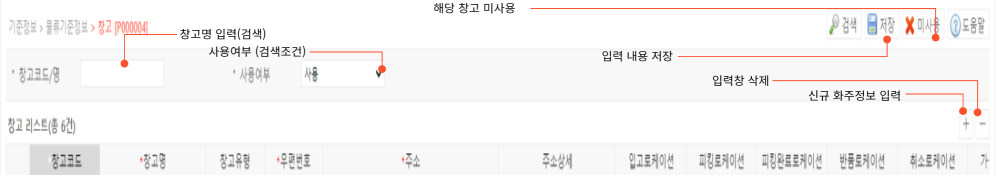

# 창고

**창고 기능은 WMS에서 관리되는 창고의 생성과 관리 기준 설정에 사용됩니다.** 

---

## **1. 창고 생성**

우측 하단의 + 모양의 버튼을 통해 신규 화주를 등록할 수 있습니다.

신규 화주 등록시 입력 내역은 다음과 같습니다.

- **창고코드 (필수)**  
창고의 고유 코드입니다.  
별도의 생성 룰은 없으며 한글입력이 가능합니다.  
생성 완료시 수정이 불가하므로 정확히 입력해주시기 바랍니다.

- **창고명 (필수)**  
창고의 명칭입니다.  
코드와 달리 수정 가능합니다.
- **창고유형**  
가상창고와 실물 창고 중 선택합니다.
  - 실물창고  
  실제 존재하는 물리적 창고입니다.
  - 가상창고  
  실제 존재하지 않지만 반품, 불량품 처리, 가입고, 납품 대기 등 시스템상 별도 재고의 구분을 위한 창고입니다.
- **우편번호 및 주소 (필수)**  
우편번호 입력칸 우측 돋보기 버튼을 눌러 창고의 우편번호와 주소를 검색합니다.  
주소의 검색 결과를 클릭시 우편번호와 주소가 자동 입력됩니다.
- **주소상세**  
주소 내 상세 위치를 입력합니다.
- **입고로케이션**  
해당창고의 기본 입고 로케이션을 지정합니다.  
지정시 해당 창고에 입고 완료된 상품은 지정 로케이션으로 입고처리되며, 적치작업을 통해 이동할 수 있습니다.
- **피킹로케이션**  
해당창고의 기본 피킹지시 로케이션을 지정합니다.
- **피킹완료로케이션**  
해당창고의 기본 피킹 완료 로케이션을 지정합니다.
- **반품로케이션**  
해당 창고의 기본 반품완료 로케이션을 지정합니다.
- **취소로케이션**  
해당 창고의 기본 취소 로케이션을 지정합니다.
- **가공로케이션**  
해당 창고의 기본 가공 로케이션을 지정합니다.
- **비고**  
기타 참고 사항을 입력합니다.

---

## 2. **버튼별 기능**
- **공통버튼**
    - **검색**  선택된 검색 조건으로 검색하여 창고 정보를 조회합니다.
    - **저장**  신규 창고 정보를 입력 후 저장하거나, 저장된 창고의 정보를 수정합니다.
    - **미사용**  선택된 창고를 미사용처리 합니다. 미사용 처리된 창고는 프로세스 진행이 제한됩니다.
- **심화 기능**  
해당 창고의 입고, 피킹, 피킹완료, 반품, 취소, 가공 로케이션을 지정할 수 있습니다.