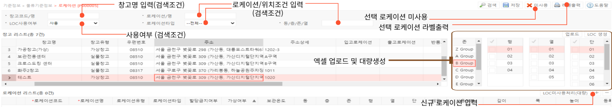

# 로케이션

**로케이션 기능은 창고 내 로케이션의 생성과 로케이션 별 속성 관리에 사용됩니다.** 

---

## **1. 로케이션 생성**

- 신규 로케이션 등록은 세가지 기능을 이용할 수 있습니다.
    - 우측 하단 + 버튼을 눌러 개별 입력
    - 우측 중간 업로드 버튼을 통한 로케이션 내역 일괄 엑셀 업로드
- 업로드 버튼 아래 생성할 존/행/열/단 체크한 후 LOC 생성 버튼을 눌러 일괄 생성  
(체크한 내역의 범위만큼 일괄 생성되며 ‘존-행-열-단’의 형태입니다.)  

  신규 로케이션 생성시 입력 내역은 다음과 같습니다.

- **로케이션코드(필수)**  
로케이션의 고유 코드입니다.  
별도의 생성 룰은 없으며 한글입력이 가능합니다.  
생성 완료시 수정이 불가하므로 정확히 입력해주시기 바랍니다.

- **로케이션명(필수)**  
로케이션의 이름입니다.

- **로케이션유형**  
사전 설정한 로케이션의 유형 중 선택합니다.

- **로케이션타입**  
해당 로케이션의 로케이션 유형을 선택합니다. (평치 / 랙 / 셀 / 자동창고)

- **할당금지여부**  
해당 로케이션의 출고 할당 가능여부를 선택합니다. 할당 불가로 설정할 경우, 해당 로케이션의 재고는 출고되지 않습니다.

- **가상여부**  
해당 로케이션의 가상 여부를 선택합니다. 반품 입고, 검수 등 가상 존을 설정할 수 있습니다.

- **보관온도**  
해당 로케이션의 온도를 선택합니다. (정온/상온/냉장/냉동)

- **동 / 층 / 존 / 행 / 열 / 단 / 레일**  
해당 로케이션의 세부 위치를 입력합니다.

- **깊이 / 폭 / 높이**  
해당 로케이션의 체적 정보를 입력합니다.

---

## **2. 버튼별 기능**

- **공통버튼**
    - **검색**  선택된 검색 조건으로 검색하여 로케이션 정보를 조회합니다
    - **저장**  신규 로케이션 정보를 입력 후 저장하거나, 저장된 로케이션의 정보를 수정합니다
    - **미사용**  선택된 로케이션을 미사용처리 합니다. 미사용 처리된 로케이션은 프로세스 진행이 제한됩니다
    - **라벨출력**  선택된 창고에 따른 로케이션 라벨을 출력할 수 있습니다.

- **마스터 그리드 버튼**
    - **업로드**  양식에 맞춰 업로드 시 여러개의 로케이션을 신규 생성하거나 수정할 수 있습니다
    - **LOC 생성**  선택된 창고, 위치에 따라 로케이션을 생성할 수 있습니다
    
- **사전 작업**
    - **마스터 그리드**  
    기준정보 > 기준정보 > 창고에서 창고가 등록 되어 있어야 로케이션을 등록할 수 있습니다
    - **심화 기능**  
    디테일 그리드의 할당금지여부가 할당불가인경우 해당 로케이션에 대해 프로세스 진행이 제한됩니다
