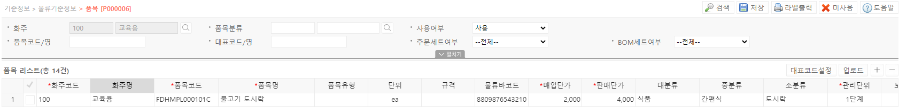

# 품목

**품목 기능은 WMS 계정 내 별도 화주 그룹의 생성과 관리에 사용됩니다.**

---

## **1. 신규 품목 등록**

신규 품목의 등록은 두가지 기능을 이용할 수 있습니다.
- 우측 상단 + 버튼을 눌러 개별 입력
- 우측 상단 업로드 버튼을 통한 로케이션 내역 일괄 엑셀 업로드

신규 품목 등록을 위해서는 다음 항목을 입력해야 합니다.

- **화주코드(필수) / 화주명**  
신규 품목의 담당 화주 코드와 화주명을 입력합니다.  
단일 화주의 경우 자동으로 입력됩니다.

- **품목코드(필수) / 품목명(필수)**  
품목의 고유 코드와 명칭을 입력합니다.  
품목코드는 생성 후 수정이 불가합니다
- **품목유형 / 단위 / 규격**  
품목의 유형은 부자재/상품으로 기본 구분값을 가지며, 단위와 규격은 자유롭게 기입할 수 있습니다.
- **물류바코드**  
상품의 바코드를 입력합니다.
- **매입단가(필수) / 판매단가(필수)**  
상품의 매입단가와 판매단가를 입력합니다.
- **대분류 / 중분류 / 소분류**  
**[기준정보>물류기준정보>품목분류]** 에서 입력한 분류 기준에 따른 상품의 카테고리 분류값을 입력합니다.
- **관리단위(필수)**  
관리 단위를 입력합니다.  
(1단계 : 낱개 / 2단계 : 박스 / 3단계 : PLT /  4단계 : 컨테이너)
- **보관온도**  
정온/상온/냉장/냉동 중 상품의 보관 온도 정보를 선택합니다.
- **유통기한(일)**  
유통기한 일 수를 입력합니다.
- **주문세트여부**  
주문시 세트 상품 여부를 입력합니다.  
(세트상품은 주문 입력시 개별 구성품 연결 필요)
- **BOM세트여부**  
BOM 구성품 여부를 입력합니다.  
(BOM 세트상품은 추후 재고의 결합 / 분해 가능)
- **가로(mm) / 세로(mm) / 높이(mm) / 체적(㎣) / 무게**  
상품의 체적정보값을 입력합니다.
- **제조사 / 제조국**  
상품의 제조사와 제조국 정보를 입력합니다.

---

## **2. 상품 라벨 출력**

우측 상단의 **라벨출력** 기능을 이용해 등록된 상품의 라벨을 출력할 수 있습니다.

- 크기 : 4cm X 2.2cm / 6cm X 4cm 중 선택 가능합니다.
- 유형 : 품목코드 바코드 / 물류코드 바코드 중 선택 가능합니다.
- 수량 : 출력할 수량을 입력합니다. 1회 최대 1000장까지 출력할 수 있으며, 1000장 이상은 필요 수량에 따라 분할 출력해야 합니다.

---

## **3. 버튼별 기능**

- **공통버튼**
    - **검색**  선택된 검색 조건으로 검색하여 품목 정보를 조회합니다
    - **저장**  신규 품목 정보를 입력 후 저장하거나, 저장된 푸목의 정보를 수정합니다
    - **미사용**  선택된 품목을 미사용처리 합니다. 미사용 처리된 품목은 프로세스 진행이 제한됩니다
- **마스터 그리드 버튼**
    - **업로드**  양식에 맞춰 업로드 시 여러개의 품목을 신규 생성하거나 수정할 수 있습니다.