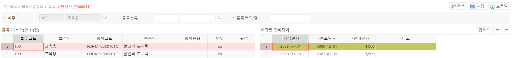

# 품목별 판매단가

**품목별 판매단가 기능은 품목의 기간별 판매 단가 입력 및 관리에 사용됩니다.**

---

## **1. 품목별 판매단가 입력**

품목별 판매 단가의 입력 항목은 다음과 같습니다,.

- 시작일자 : 각 판매 단가의 설정 시작일입니다.
- 종료일자 : 각 판매 단가의 설정 종료일입니다. 
종료일을 알 수 없을 경우 9999-12-31로 설정해두면 됩니다. 
이 경우 새로운 판매 단가의 시작일이 설정되면 자동으로 다음 판매 단가의 시작 전 날짜로 종료일자가 변경됩니다.
- 판매단가 : 판매 단가를 입력합니다. 
(해당 판매단가는 기본 판매단가이며, 이후 주문 처리 과정에서 실제 판매단가를 입력할 수 있습니다.)

---

## **2. 버튼별 기능**

- **공통버튼**
    - **검색**  선택된 검색 조건으로 검색하여 품목-판매단가 정보를 조회합니다**저장**  선택된 품목에 대한 기간별 판매단가의 현재상태를 저장합니다
    - **디테일 그리드 버튼**
- **업로드**  양식에 맞춰 업로드 시 특정 품목의 판매단가를 신규 생성하거나 수정할 수 있습니다.