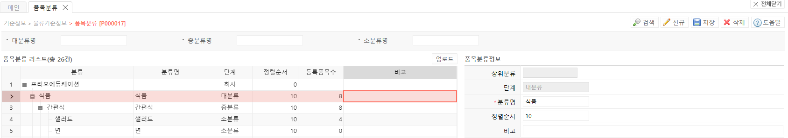

# 품목 분류

**품목분류 기능은 품목의 대/중/소 분류 정보 입력 및 관리에 사용됩니다.**

이를 기반으로 **Ⅷ.품목** 기능에서 분류별 검색을 진행할 수 있습니다.

---

## **1. 신규 품목 분류 기준 생성**

신규 품목 분류 기준 생성을 위해서는 다음 항목을 입력해야 합니다.

- 분류명 : 분류 기준입니다. 고유값을 가지며 생성 후 수정이 불가합니다.
- 단계 : 대-중-소 분류입니다. 거래처 분류와 달리 개별 선택이 불가하며, 특정 값을 선택 후 신규 버튼을 누르면 해당 값의 하위 분류로 자동 선택됩니다.
- 정렬순서 : 분류 순서의 기준입니다. 낮은 수로부터 큰 수로 오름차순으로 올라가며 같은 분류 안에서 정렬순서를 조정할 수 있습니다.
- 비고 : 기타 참고사항을 입력합니다.

---

## **2.버튼별 기능**

- 공통버튼
    - 검색  선택된 검색 조건으로 검색하여 품목 분류 정보를 조회합니다
    - 신규  선택된 행 하위 레밸로 품목 분류가 생성됩니다
    - 저장  추가되거나 수정된 그리드의 현재 상태를 저장합니다
    - 삭제  선택된 행의 품목 분류를 삭제합니다. 하위 분류가 있을 경우 함께 삭제됩니다
- 마스터 그리드 버튼  
업로드  양식에 맞춰 업로드 시 여러개의 품목 분류를 신규 생성하거나 수정할 수 있습니다

- 심화 기능  
품목분류정보의 정렬순서로 품목 분류의 순서를 지정할 수 있습니다