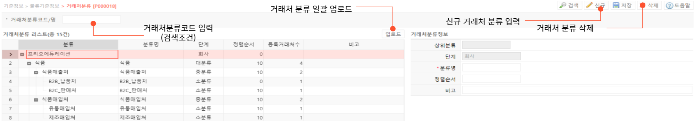

# 거래처 분류

**거래처 분류 기능은 거래처의 분류 및 관리에 사용됩니다.**

---

## **1. 신규 거래처 분류 기준 생성**

신규 거래처 분류 기준 생성을 위해서는 다음 항목을 입력해야 합니다.

- 분류 : 분류 기준입니다. 고유값을 가지며 생성 후 수정이 불가합니다.

- 분류명 : 분류기준의 명칭입니다.
- 대-중-소 분류중 선택합니다. 해당값은 입력 후 수정이 불가하므로 상위 분류 기준과 정확하게 매칭되었는지 한번 더 확인해 주시기 바랍니다.
- 정렬순서 : 분류 순서의 기준입니다. 낮은 수로부터 큰 수로 오름차순으로 올라가며 같은 분류 안에서 정렬순서를 조정할 수 있습니다.
- 등록거래처수 :해당 분류 단계로 지정된 등록 거래처 수를 확인할 수 있습니다.
- 비고 : 기타 참고사항을 입력합니다.

## 2.**버튼별 기능**

---

- **공통버튼**
    - **검색**  선택된 검색 조건으로 검색하여 거래처 분류 정보를 조회합니다
    - **신규**  선택된 행 하위 레밸로 거래처 분류가 생성됩니다.
    - **저장**  추가되거나 수정된 그리드의 현재 상태를 저장합니다
    - **삭제**  선택된 행의 거래처 분류를 삭제합니다. 하위 분류가 있을 경우 함께 삭제됩니다
- **마스터 그리드 버튼**
    - **업로드** 양식에 맞춰 업로드 시 여러개의 거래처 분류를 신규 생성하거나 수정할 수 있습니다
- **심화 기능**  
거래처분류정보의 정렬순서로 거래처 분류의 순서를 지정할 수 있습니다