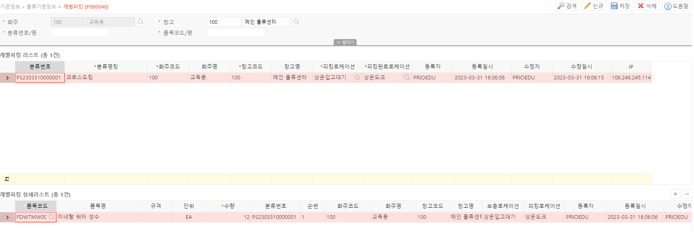

# 개별 피킹품목 설정

**개별 피킹 품목 설정은 개별 피킹을 원하는 품목을 설정 및 관리할 수 있는 기능입니다.**

- **공통버튼**
    - **검색**  선택된 검색 조건으로 검색하여 개별피킹 정보를 조회합니다
    - **신규**  마스터 그리드에 신규 개별피킹 목록을 생성합니다
    - **저장**  추가되거나 변경된 개별피킹에 대한 현재상태를 저장합니다
    - **삭제**  선택된 마스터 그리드의 행을 삭제합니다