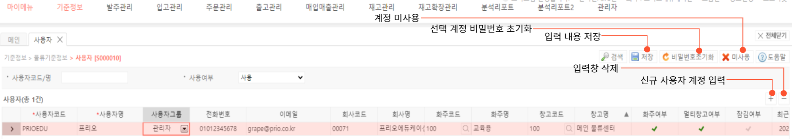

# 사용자

**사용자 기능은 사용자 별 계정의 생성과 관리에 사용됩니다.** 

---

## **1. 사용자 계정 생성**

우측 하단의 + 모양의 버튼을 통해 신규 사용자 계정을 입력할 수 있습니다.

신규 사용자 계정의 입력 내역은 다음과 같습니다.

- **사용자코드 (필수)**   
사용자의 로그인 계정을 입력합니다.  
사용자코드는 4~20자의 영문자, 숫자, 특수기호(_)만 사용 가능하며 대/소문자를 구분하지 않습니다.

- **사용자명 (필수)**  
사용자의 이름입니다.
- **사용자그룹**  
사용자 구분을 진행할 수 있습니다. 지정된 사용자 그룹에 따라 사전 설정한 시스템의 접근과 수정 권한이 부여됩니다.
- **전화번호**  
사용자의 전화번호입니다.  
(비밀번호 분실시 해당 주소로 인증을 받을 수 있습니다.)
- **이메일**  
사용자의 이메일입니다.  
(비밀번호 분실시 해당 주소로 인증을 받을 수 있습니다.)
- **회사코드**  
WMS상의 회사 코드입니다.  
계정 내 연동이 1개의 기업으로 되어있는 경우, 자동으로 입력됩니다.
- **회사명**  
WMS상의 회사명입니다.  
계정 내 연동이 1개의 기업으로 되어있는 경우, 자동으로 입력됩니다.
- **화주코드**  
WMS상의 화주코드입니다.  
3PL 기업의 경우 해당 값으로 화주를 구분할 수 있습니다. (**[기준정보>물류기준정보>화주]** 페이지에서 사전 등록 필요)
- **화주명**  
WMS상의 화주명입니다.  
3PL 기업의 경우 해당 값으로 화주를 구분할 수 있습니다. (**[기준정보>물류기준정보>화주]** 페이지에서 사전 등록 필요)
- **창고코드**  
사용자의 기본 창고코드를 설정합니다.  
멀티창고를 운영하는 경우 **[기준정보>물류기준정보>창고]** 페이지에서 계정별 창고 권한을 설정할 수 있습니다.
- **창고명**  
사용자의 기본 창고명을 설정합니다.  
멀티창고를 운영하는 경우 [**[기준정보>물류기준정보>창고]** 페이지에서 계정별 창고 권한을 설정할 수 있습니다.
- **화주여부**  
화주 여부를 체크합니다.  
화주여부 체크시 화주 코드를 필수 입력하여야 합니다. 
화주로 설정시 해당 화주사의 모든 상품의 열람 권한이 있으므로, 협력사의 경우 화주코드를 설정하지 않도록 주의해야합니다.
- **멀티창고여부**  
멀티창고의 사용 여부를 체크합니다.
- **잠김여부**  
5회연속 비밀번호가 틀린경우 계정이 잠김상태가 됩니다.  
**(대표 관리자가 잠금을 해지할 수 있습니다.)**

---

## **2. 버튼별 기능**

- **공통버튼**
    - **검색**  선택된 검색 조건으로 검색하여 등록된 사용자를 조회합니다
    - **저장**  신규 사용자 등록 후 저장하거나, 저장된 사용자 정보를 수정합니다
    - **비밀번호 초기화**  선택된 사용자의 비밀번호를 초기화 합니다(초기화 시 비밀번호는 ID의 소문자)
    - **미사용**  선택된 사용자를 미사용 처리 합니다. 미사용처리된 사용자는 로그인을 비롯한 페이지 활동이 제한됩니다