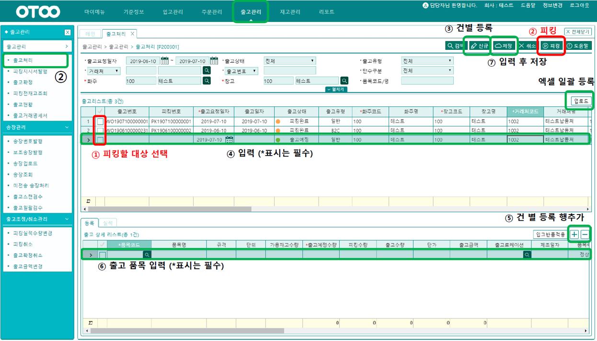
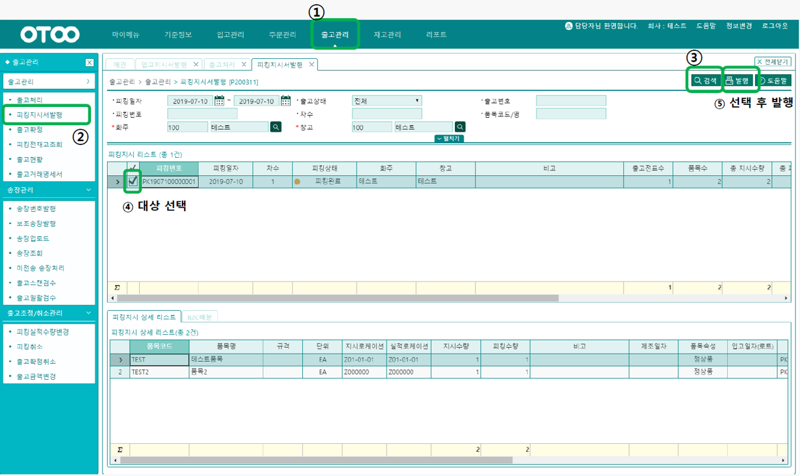
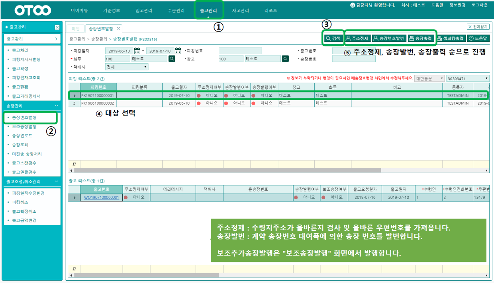
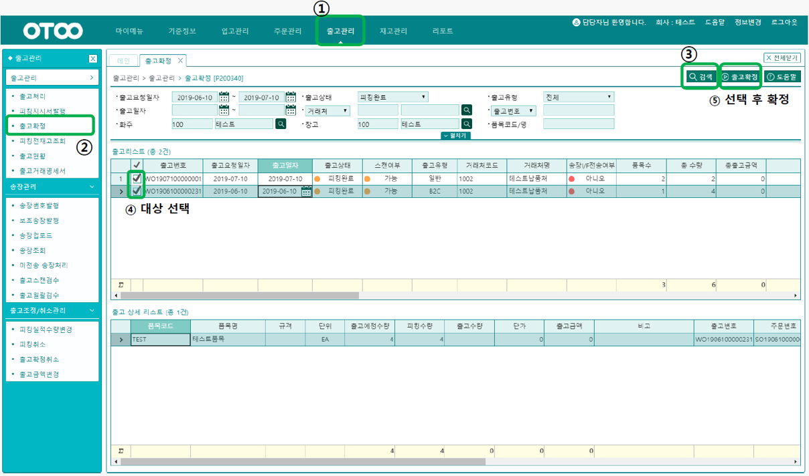

# 타 계정 수정 테스트입니다.
출고관리 화면입니다.
-- --
## 출고처리
> ### 출고관리> 출고관리 > 출고처리 [P200301]

주문관리를 이용한 경우에는, 출고 예정정보가 등록된 상태입니다.    
만약 출고관리부터 이용한 경우에는 이 화면에서 출고정보를 신규버튼으로 개별 등록하거나, 업로드 버튼을 이용하여 대량 등록할 수 있는 화면입니다.

등록된 출고정보를 선택하여 , 피킹 버튼으로 피킹지시서를 생성합니다.
해당상품의 재고는 할당되어 출고가능수량에서 빠지게 됩니다.

-- --
## 피킹지시서발행
### 출고관리 > 출고관리 > 피킹지시서발행 [P200311]

피킹지시서를 프린터로 출력합니다

-- --
## 송장번호발행
### 출고관리 > 송장관리 > 송장번호발행 [P200316]

피킹작업단위로 택배사연동을 통한 송장을 출력합니다.

송장출력 전 "택배사관리" 화면에서 택배 고객 ID 가 등록되어 있어야 합니다.    
1. 주소정제
2. 송장발번
3. 송장출력

순으로 진행합니다

-- --
## 출고확정
> ### 출고관리 > 출고관리 > 출고확정 [P200340]

피킹 완료한 출고 건에 대해 확정 합니다.    
출고확정을 하게 되면 할당(작업) 걸린 수량이 차감되어 재고가 빠지게 됩니다.
